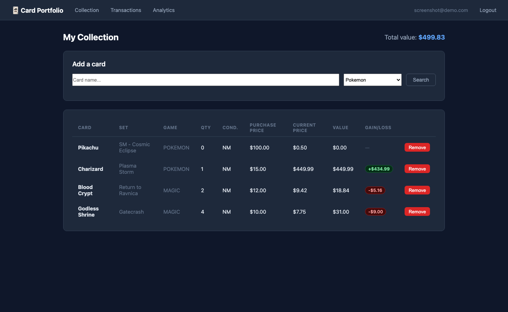
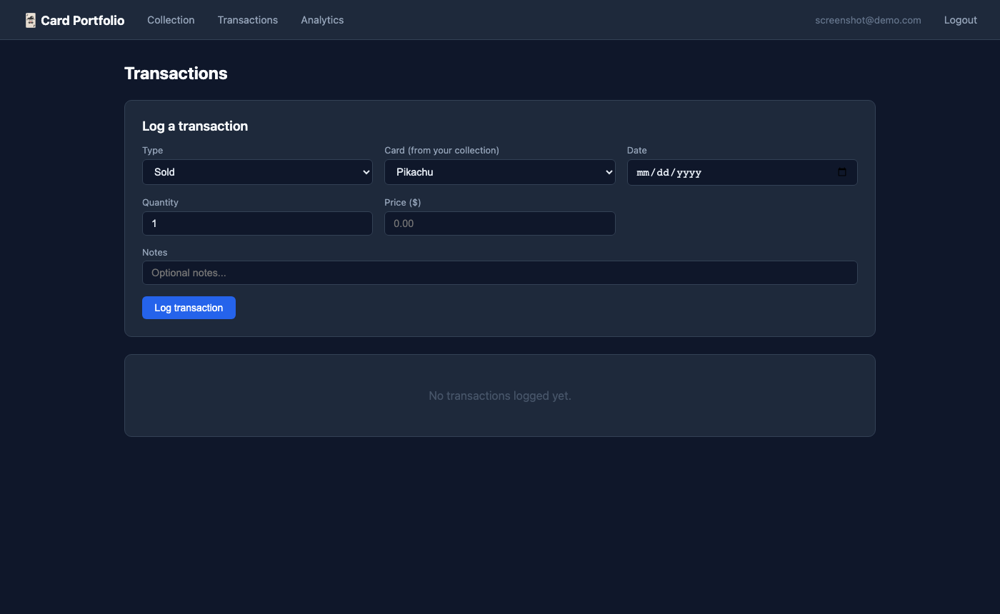
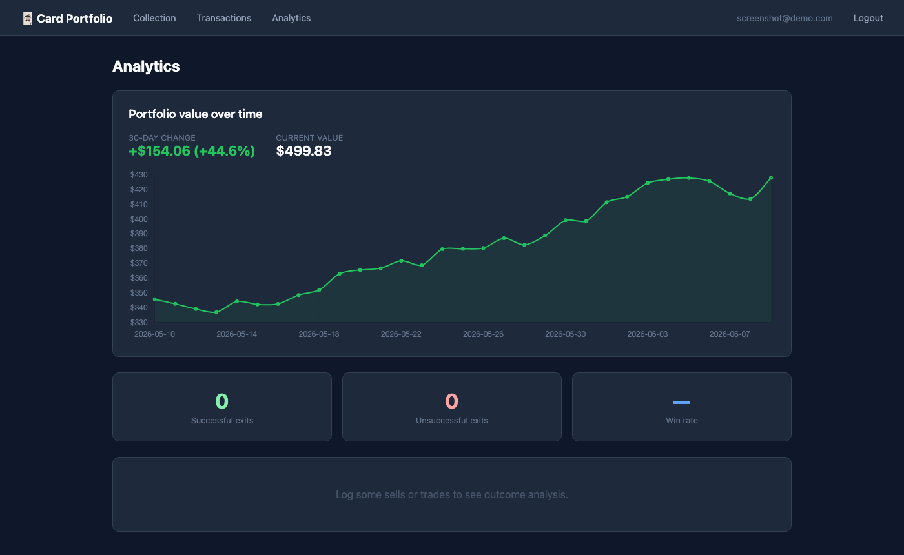

# Card Portfolio Tracker

A full-stack Python web application for tracking collectible trading card collections, monitoring real-time market prices, and analyzing trade performance over time.

Built with Flask, SQLAlchemy, and the TCGApi — supporting 89+ games including Pokémon, Magic: The Gathering, and Yu-Gi-Oh.

---

## Screenshots

### Collection


### Transactions


### Analytics


---

## Features

- **Multi-user authentication** — secure registration and login with bcrypt password hashing
- **Collection management** — search 89+ card games, add cards with purchase price and condition, track quantity
- **Real-time pricing** — live market prices fetched from TCGApi on card add, refreshed daily via background scheduler
- **Portfolio value tracking** — daily snapshots of total collection value with Chart.js line graph visualization
- **Transaction logging** — record buys, sells, and trades with date, price, and notes
- **Trade analytics** — automatic outcome analysis comparing your exit price against post-transaction market movement, with win rate tracking and advisory recommendations

---

## Tech Stack

| Layer | Technology |
|---|---|
| Backend | Python 3, Flask |
| Database | SQLite via SQLAlchemy ORM |
| Authentication | Flask-Login, bcrypt |
| Scheduling | APScheduler |
| External API | TCGApi (89+ card games) |
| Frontend | Jinja2 templates, Chart.js |

---

## Architecture

```
card_portfolio/
├── app/
│   ├── models/          # SQLAlchemy models (User, Card, Collection, Transaction,
│   │                    #   PriceHistory, PortfolioSnapshot)
│   ├── routes/          # Flask blueprints (auth, collection, transactions,
│   │                    #   prices, analytics)
│   ├── services/        # Business logic (TCGApi client, price fetcher, analyzer)
│   └── templates/       # Jinja2 HTML templates
├── scheduler/           # APScheduler daily price + portfolio snapshot job
├── config.py            # Environment-based configuration
└── run.py               # Application entry point
```

**Data model highlights:**
- Cards are stored once and shared across users — price history is fetched centrally to stay within API rate limits
- Portfolio snapshots are recorded daily per user, enabling historical value charting
- Transactions record the card, type (bought/sold/traded), price, and optional trade counterpart — enabling post-hoc outcome analysis

---

## Trade Analytics

The analyzer evaluates every sell and trade against subsequent market prices:

- **Sold too early?** — flags cards whose price rose after you sold
- **Good exit?** — confirms cards whose price dropped after you sold
- **Win rate** — percentage of transactions where you exited at or above market value
- **Recommendations** — surfaced automatically based on your historical patterns

A transaction is considered **successful** if collection value increased as a result — measured by comparing the transaction price against the 30-day post-transaction market price.

---

## Getting Started

### Prerequisites
- Python 3.8+
- A free TCGApi key from [tcgapi.dev](https://tcgapi.dev) (100 requests/day free tier)

### Installation

```bash
git clone https://github.com/alexrichterworks-ai/card-portfolio.git
cd card-portfolio
pip install -r requirements.txt
```

### Configuration

```bash
export TCG_API_KEY="your_tcgapi_key"
export SECRET_KEY="your_secret_key"        # any random string
```

### Run

```bash
python run.py
```

Open [http://localhost:5001](http://localhost:5001), register an account, and start adding cards.

---

## API Endpoints

| Method | Endpoint | Description |
|---|---|---|
| `GET` | `/collection` | View collection with current values |
| `GET` | `/collection/search?name=&game=` | Search cards via TCGApi (up to 50 results) |
| `POST` | `/collection/add` | Add card to collection |
| `POST` | `/transactions/log` | Log a buy, sell, or trade |
| `GET` | `/analytics` | Portfolio chart + trade outcome analysis |
| `GET` | `/prices/<card_id>/history` | 30-day price history JSON |
| `GET` | `/analytics/portfolio.json` | Portfolio value trend JSON |

---

## Database Schema

```
users ──< collection >── cards ──< price_history
  │                               
  └──< transactions
  └──< portfolio_snapshots
```

- `users` — email, bcrypt password hash
- `cards` — shared card catalog (TCGApi ID, name, set, game)
- `collection` — per-user card ownership (quantity, condition, purchase price)
- `transactions` — buy/sell/trade log with price and date
- `price_history` — daily price snapshots per card (shared across users)
- `portfolio_snapshots` — daily total collection value per user

---

## Roadmap

- [ ] Card image display in collection view
- [ ] Price alert email notifications when target price is hit
- [ ] CSV import for bulk collection upload
- [ ] Expanded analytics: best/worst performing cards, average hold time
- [ ] PostgreSQL support for production deployment

---

## License

MIT
